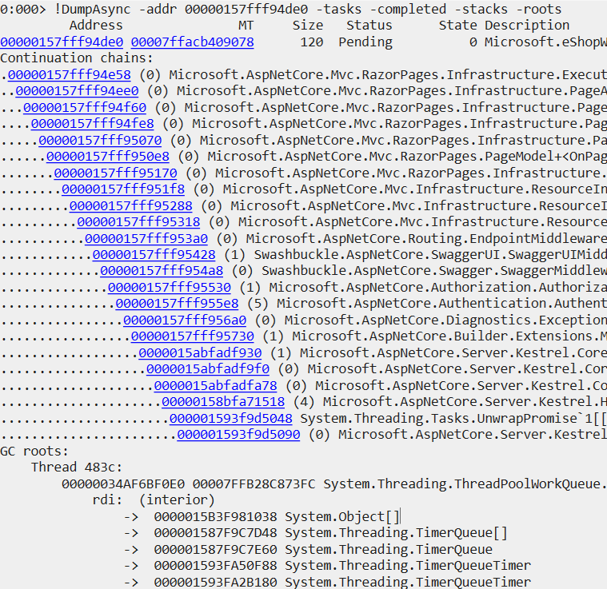
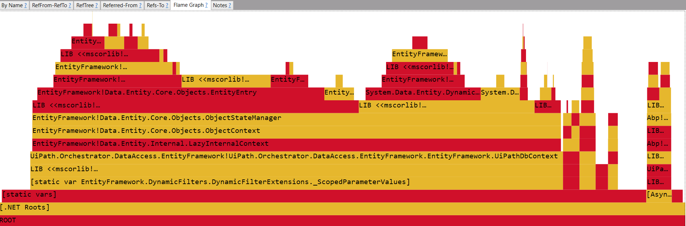
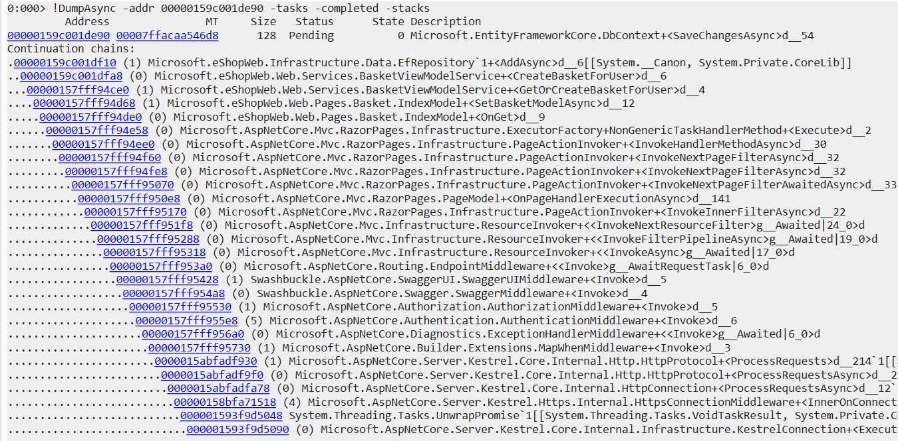

# **Analyzing .NET memory dumps**
### Vasile Bujac
Software Engineer 


---

## **What helps?**
- Basic knowledge of CLR internals
- How TPL and `async/await` works
- Knowing how to read and debug someone else's code
- An inquisitive mind

<!-- 
paginate: true 
footer: Analyzing .NET memory dumps
-->

---

## **What kind of issues can I investigate?**
- :white_check_mark: App is leaking memory
- :white_check_mark: App is spawning lots of threads / handles
- :white_check_mark: Crashes or app not responding
- :grey_question: Increased CPU consumption
- :grey_question: App is slow
- :no_entry: Analyzing algorithm complexity 

---

## **Get the tools**
- [**WinDbg Preview** Windows store app](https://www.microsoft.com/store/p/windbg/9pgjgd53tn86)
- [Debugging Tools for Windows 10](https://docs.microsoft.com/en-us/windows-hardware/drivers/debugger/debugger-download-tools)
- [**ProcDump** (Sysinternals suite)](https://docs.microsoft.com/en-us/sysinternals/downloads/sysinternals-suite)
- [**Perfview**](https://github.com/microsoft/perfview/releases)
- [**NetExt** debugging extension for WinDbg](https://github.com/rodneyviana/netext)    
- [**Mex** debugging extension for WinDbg](https://www.microsoft.com/en-us/download/details.aspx?id=53304)
- **`dotnet tool install -g dotnet-dump`**
- **`dotnet tool install -g dotnet-gcdump`**

---

## **Collect a memory dump**
- **`procdump.exe -ma -g -e 1 -f C00000FD.STACK_OVERFLOW <pid>`**
- **`dotnet dump collect -p <pid>`** (Linux, Windows)
- **`dotnet gcdump collect -p <pid>`**, not an actual memory dump

---

## **Set up symbols**
- **`_NT_SYMBOL_PATH`** environment variable
- **`.sympath cache*c:\symbols;srv*https://msdl.microsoft.com/download/symbols`**
- **`!ld*`** to load all module symbols

---

## **Loading SOS and other WinDbg extensions**
The runtime versions and bitness must match
- **`.loadby sos clr`** for local .NET Framework SOS
- **`.loadby sos coreclr`** for local .NET Core SOS
- **`.cordll -l -ve`** can automatically load the _correct_ SOS version from Microsoft's public sumbols servers
- **`!analyze`** 
- **`.load <path/to/sos.dll>`** for loading a particular version of SOS.dll
- **`.load <path/to/x64/netext.dll>`** for loading extensions

---

## **Where to look first?**
- Threads & stacks
- Exceptions 
- Heap and object stats
- Locks

---

## **App is slow, has crashed or not responding**
|Command|Description|
|:-|:-|
| **`![w|m]threads`** | List managed threads, `-live` to display live threads only |
| **`!threadpool`**| Basic information about thread pool | 
| **`![w]clrstack`** | Dump current thread CLR stack |
| **`~*e![w]clrstack`** | Dumps all managed thread stacks |
| **`!eestack [-short] [-ee]`**| Runs `!DumpStack` on all threads in the process |
| **`!wk`** | (NetExt) Dump stacks in mixed mode (native/managed) |
| **`!dso`** or **`!wstack`** | Dump (unique) stack objects |

---

## **App is leaking memory**
|Command|Description|
|:-|:-|
|**`!dumpheap`**|Powerful command that traverses the garbage collected heap.With it's various options, it can look for particular types, restrict to a range, or look for ThinLocks|
|**`!eeheap`**|Enumerates process memory consumed by internal CLR data structures|
|**`!heapstat`**|Shows the generation sizes for each heap and the total, how much free space there is in each generation on each heap|
|**`!gcroot`**|Looks for references (or roots) to an object |

---

## **Troubleshooting issues**
|Command|Description|
|:-|:-|
| **`!pe`** or **`!wpe`** | Prints current exception |
| **`!wdae`** | (NetExt) Shows all exceptions in heap grouped by stacktraces |
| **`!dae`** | (Mex) Shows all exceptions in heap grouped by stacktraces |
| **`!syncblk`** | Useful for investigating locking issues (deadlocks, lock contention) |
|**`!finalizequeue`**|Finalizer queue |

---

## **Viewing `.gcdump` files with PerfView**
View **`dotnet gcdump collect`** output or extract a `.gcdump` file from a memory dump
<br />



---

## **Debugging async task chains**
- **`!dumpasync`** is only available on .NET Core debugging tools 
- For .NET Framework, `SosThreadingTools` is an extension with limited functionality
- NetExt **`!wfrom`** can also be used to some degree

---



---

## **Mex debugging extension**
|Command|Description|
|:-|:-|
|**`!mthreads`**| Dumps all threads and display what they're doing |
|**`!aspxpagesext`**| Dump all ASP.NET requests |
|**`!sqlcmd`**| Provides information about ADO.NET Commands to SQL Server |
|**`!sqlcn`**| Provides an overview of ADO.NET connections to SQL Server |
|**`!dae`**| Dump all exceptions in heap|

---

## **NetExt is great**
|Command|Description|
|:-|:-|
|**`!wfrom`**|Perform SQL-like analysis of Heap objects enabling comparison, expression evaluation and indexed filtering.|
|**`!whttp`**|Lists HttpContext Objects|
|**`!wruntime`**|Display HTTP Runtime Info including Active Requests|
|**`!wservice`**|List WCF service Objects|
|**`!wsocket `**|Dump socket information|
|**`!wsql`**|List SQL queries|
---

## **Finding objects with !wfrom**

Listing ASP.NET Core requests (Kestrel)
```
!wfrom -nofield -nospace -implement *.Http1Connection
    select 
        $addr(), "  ", 
        $rpad($enumname(_requestProcessingStatus), 12), 
        $rpad($stackroot($addr()), 10), "  ", 
        _statusCode, "  ", 
        $isnull(_methodText, ""), " ", 
        $isnull(_RawTarget_k__BackingField, "<unavailable>")

```

--- 

## **ClrMd**
`Microsoft.Diagnostics.Runtime` is a set of APIs for introspecting processes and dumps. 
- Write your own diagnostics tools or WinDbg extension
- Can attach to a live process or load a memory dump

```csharp
var dt = DataTarget.LoadDump(@"path\to\memory\dump.dmp");
var clrRuntime = dt.ClrVersions[0].CreateRuntime();
var duplicateStrings = clrRuntime.Heap.EnumerateObjects()
    .Where(x => x.Type == clrRuntime.Heap.StringType)
    .Select(x => (Value: x.AsString(), x.Size))
    .GroupBy(x => x.Value)
    .Select(x => (Value: x.Key, Count: x.Count(), Size: x.Sum(a => (long)a.Size)))
    .Where(x => x.Count > 1)
    .OrderByDescending(x => x.Size);
```